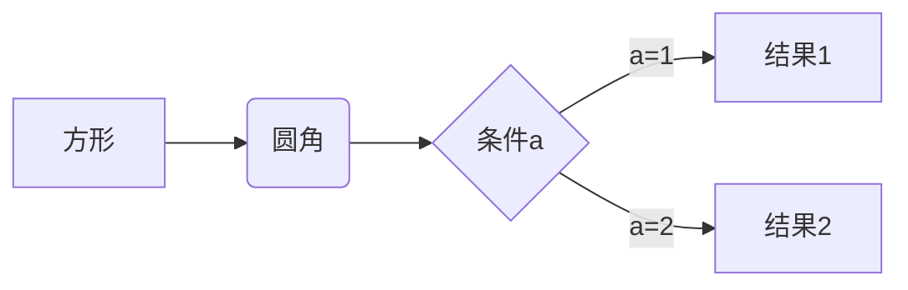

# MarkDown基础语法

什么么是md，即markdown文件的基本常用编写语法,是一种快速标记、快速排版语言

## **一.标题语法**
#### 方法1：
使用#符号来表示标题级别，1-6个#分别对应1-6个标题级别
```
      1 #：一级标题 
      2 ##：二级标题   
      3 ###：三级标题  
      4 ####：四级标题  
      5 #####：五级标题  
      6 ######：六级标题
```
#### 方法2：
```
直接用标签<h1>来控制</h1>,尖括号< h1~h6 >分别表示一到六级标签		
```
当然，如果你在一些笔记软件上会有其他的快捷键
```
    - CTRL+数字1-6：将文本设置对应的标签
    - CTRL+0：将选中文本设置为普通标签
    - CTRL++/-: 增加/减少标题级别
```

## **二.段落**
#### 1.换行
```
    在行末加上两个空格再回车，或直接使用空行来换行。
```

#### 2.分割线
```
    使用三个或三个以上的-或*来创建分割线
    1.  ----
    2.  ****
```
效果：
------

******

## **三.文本显示**
#### 1.字体
```
    1. 粗体：**文本**  或  __文本__
    2. 斜体：*文本*    或   _文本_ 
    3. 粗斜体：***文本*** 或  ___文本___
    4. 删除线：~~文本~~ 
    5. 下划线：<u>文本</u>
    6. 高亮：==文本==
```
###### 效果：
   - 粗体：**文本** 或 __文本__
   - 斜体：*文本* 或 _文本_
   - 粗斜体：***文本*** 或 ___文本___
   - 删除线：~~文本~~
   - 下划线：<u>文本</u>
   - 高亮：==文本==
当前展示的可能会没有效果，因为有的语法不支持，如果你使用typora或者obsidian等专业的笔记软件应该是可以的
#### 2.上下标
    1. 上标：X^2^
    2. 下标：H~2~O
效果：
   · 上标：X^2^
   · 下标：H~2~O   

   如果你用专业的软件打开也不管用，可能是设置没开，去你的编辑器设置里，将对应的语法功能打开
## **四.列表**
#### 1.无序列表
使用-、*或+作为列表标记：
```
        - 项目1
        * 项目2
        + 项目3
```
效果：
   - 项目1
   * 项目2
   + 项目3
#### 2.有序列表
   使用数字加点：
     1. 第一项
     2. 第二项
     3. 第三项
###### 效果;
   1. 第一项
   2. 第二项
   3. 第三项
#### 3.任务列表
```
        - [ ] 未完成任务
        - [x] 已完成任务
```
效果:

- [ ] 未完成任务
- [x] 已完成任务

## 五.区块引用
使用>符号：
```
        > 这是一个引用
        >> 这是嵌套引用
```
效果：
   >这是一个引用
   >
   >>这是嵌套引用
## **六.代码**
#### 1.行内代码块
使用反引号包裹：
```
        `代码`
```
效果：`代码`
#### 2.代码块
使用三个反引号包裹，可指定语言：
```
        //这里`加了空格，方便观看，可直接去掉
        ` ` ` java
          System.out.println("Hello World!"); 
        ` ` `
```
效果：
``` java
        System.out.println("Hello World!"); 
```
## **七.链接**
使用方法：
```
     [连接文本]（URL "可自定义标题"）
     <URL>
```
效果：[连接文本](URL)
## 八.图片
```
        
```
效果：

## 九.表格
```
        |列1|列2|列3|
        |-----|:---:|----:|
        |左对齐|居中|右对齐|
```
效果：
|列1|列2|列3|
|-----|:---:|----:|
|左对齐|居中|右对齐|
## 十.数学公式
```
        使用 $ 包裹行内公式，使用 $$ 包裹块级公式
```
效果：
行内公式：$E=mc^2$
块级公式：
$$
n!     
 
k!(n-k)!
=(n k )
$$
## 十一.流程图
使用mermaid语法


```txt
​```mermaid
    graph LR
      A[方形] -->B(圆角)
      B -->C{条件a}
      C -->|a=1| D[结果1]
      C -->|a=2| E[结果2]
```
效果：
